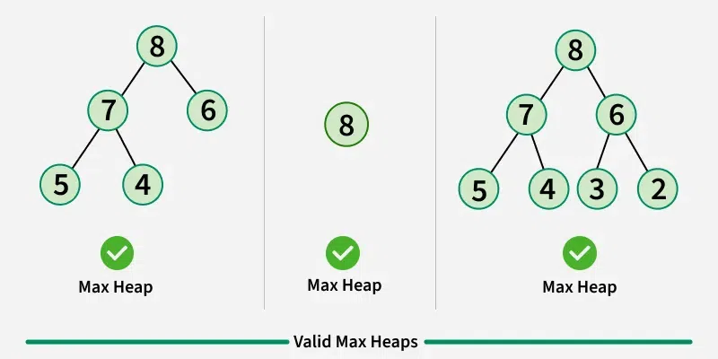
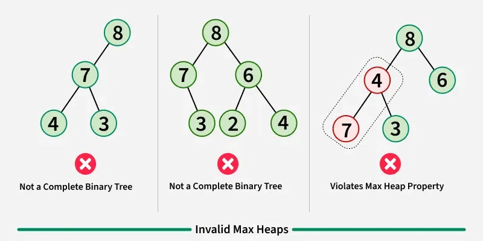

# Heap

## Definition

A **heap** is a comparison-based data structure in the form of a \*complete binary tree. It follows the *heap property*, which is defined as follows:

**Every node in a heap is greater than or equal to its children in value.**

> \* **Note:** A complete binary tree is a binary tree that is filled at all levels except the lowest one, and is filled left-to-right.

| Valid heaps                   | Invalid max heaps            |
| ----------------------------- | ---------------------------- |
|      |     |

## Functionalities

A heap should be able to perform the following functionalities:

1. Finding the maximum element in `O(1)` time.
2. Removing the maximum element in `O(log n)` time.
3. Inserting a new element in `O(log n)` time.
4. Convert an array into a heap in `O(k)` time, where `k` is the length of the array.

Here, `n` is the number of elements in the heap.

## Implementation

Suppose you are given an existing heap. Since it is a complete binary tree, the structure of a tree is known at any point; thus, we can replace the tree entirely with an array, with nodes being replaced by array elements at the BFS discovery order index.

From here it becomes obvious that a tree with height `k` can have up to `2^k-1` nodes; hence, the height of a tree with `n` nodes is `O(log n)`.

Consider for all implementations below a heap that satisfies the heap property at every single node. Let it have `n` nodes and height `h`.

### Finding the maximum element

Since it satisfies the heap property, the maximum element in the heap must be the root element. (We can prove this by contradiction - if there was any other node that was the maximum element, its parent does not satisfy the heap property.) Thus, returning the first element of the heap is sufficient to get the maximum element. Naturally this takes `O(1)` time.

### Removing the maximum element

Since it satisfies the heap property, we can remove the first element of the heap (as discussed above - the first element is the maximum element), and replace it with any other element in the heap. (We generally do this with the last element, since it is the easiest to move.) Then, the only element of the heap that can disobey the heap property is the (new) root element itself.

If the root does not satisfy the heap property, we can swap it with the greater of its children so that the heap property is satisfied by the root again. Now, the only node that potentially does not satisfy this property is the child of the root that we just swapped - we can repeat this process of swapping with the new nodes' children until the newly swapped node satisfies the heap property (or does not have any children, which vacuously satisfies the heap property). This recursive procedure to ensure that the heap property is retained is known as **top-down heapification**.

There will be at most `h` iterations of each replacement in top-down heapification. As discussed earlier, `h` is equivalent to `O(log n)`; hence, the time complexity of the top-down heapification procedure is `O(log n)`.

### Inserting a new element

In a similar fashion to above, you can insert the new element at the end of the heap array. Now, the only node that potentially does not satisfy the heap property is the parent of the newly inserted leaf node - you can make it obey the heap property by swapping it with the larger of its two children. Similarly, now the only node that may not satisfy the heap property is the parent node to the current node - you can repeat this process recursively (again) until you reach the root of the tree or you find a node at which the heap property is satisfied. This recursive procedure is known as **bottom-up heapfication**.

Like before, there will be at most `h` iterations of each replacement in bottom-up heapification. As discussed earlier, `h` is equivalent to `O(log n)`; hence, the time complexity of the bottom-up heapification procedure is `O(log n)`.

### Converting an array into a heap (Heapification)

