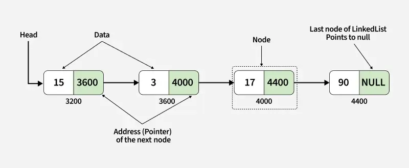
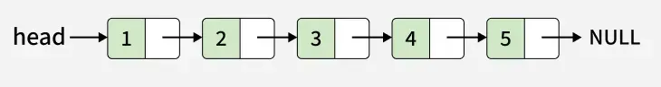
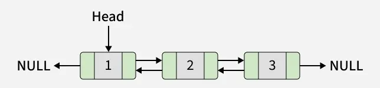

# Linked List

## Definition

A **linked list** is a non-contiguous linear data structure in which consecutive elements are linked to each other (unidirectionally or bidirectionally) using pointers. Each element (called a **node**) consists of two parts:
- **Data**: the value stored in the node
- **Pointer(s)**: references to other nodes in the list

Linked lists are mainly used for efficient insertion and deletion of elements, but they come at the cost of **non-indexability** and poorer cache locality compared to arrays.

There are two primary types of linked lists:

- **Singly linked lists**, where each node contains a pointer to the next node.
- **Doubly linked lists**, where each node contains pointers to both the previous and the next nodes.

| Singly linked list               | Doubly linked list               |
| -------------------------------  | -------------------------------- |
|  |  |

## Functionalities

A linked list should be able to perform the following operations:

1. Searching for an element in `O(n)` time.
2. Inserting an element at the beginning in `O(1)` time.
3. Inserting an element at the end in `O(n)` time.
4. Deleting an element from the beginning in `O(1)` time.
5. Deleting an element from the end in `O(n)` time.

Some additional functionalities may include:

6. Reversing the list in `O(n)` time.
7. Detecting a cycle in the list in `O(n)` time.

Here, `n` is the number of elements in the linked list.

## Implementation

A linked list is implemented using **nodes**, where each node stores a value and pointer(s) to other nodes. Unlike arrays, memory allocation for linked lists is dynamic, and nodes do not need to be stored contiguously in memory.

We assume the linked list maintains a pointer to the `head` node (and optionally to the `tail` node).

All the implementations given below work for both singly and doubly linked lists - just ensure to update the previous pointers accordingly as well.

### Searching for an element

To search for an element in a linked list, we must traverse the list starting from the head and compare each node’s value with the target value.

Since there is no direct indexing (unlike arrays), every node may need to be visited in the worst case. Therefore, searching takes `O(n)` time.

### Inserting an element at the beginning

To insert a new element at the beginning of the list:

1. Create a new node.
2. Set the new node’s `next` pointer to the current head.
3. Update the head pointer to the new node.

Since this operation involves only a constant number of pointer updates, it takes `O(1)` time.

### Inserting an element at the end

To insert a new element at the end:

1. Traverse the list from the head until the last node is reached.
2. Create a new node.
3. Update the `next` pointer of the last node to point to the new node.

Traversal takes `O(n)` time, so insertion at the end is `O(n)`.

> **Note:** If the linked list maintains a tail pointer, insertion at the end can be done in `O(1)` time.

### Deleting an element from the beginning

To delete the first element:

1. Store the current head node in a temporary variable.
2. Update the head pointer to the next node.
3. Free the memory of the removed node.

This requires a constant number of operations and thus runs in `O(1)` time.

### Deleting an element from the end

To delete the last element:

1. Traverse the list to reach the second-last node.
2. Update its `next` pointer to `NULL`.
3. Free the memory of the last node.

Traversal dominates the operation, so deletion from the end takes `O(n)` time.

> **Note:** If the linked list maintains a tail pointer, deletion at the end can be done in `O(1)` time.

### Reversing the linked list

To reverse a singly linked list, we iteratively reverse the direction of each node’s `next` pointer:

1. Maintain three pointers: `previous`, `current`, and `next`.
2. Traverse the list while reversing the `next` pointer of each node.
3. Update the head pointer at the end.

Each node is visited exactly once, so the time complexity is `O(n)`, and the space complexity is `O(1)`.

### Detecting a cycle in the list

Cycle detection can be performed using **Floyd’s Cycle Detection Algorithm (Tortoise and Hare)**:

1. Use two pointers:
   - A slow pointer that moves one step at a time.
   - A fast pointer that moves two steps at a time.
2. If the list contains a cycle, the two pointers will eventually meet.
3. If the fast pointer reaches `NULL`, the list does not contain a cycle.

This algorithm runs in `O(n)` time and uses `O(1)` extra space.